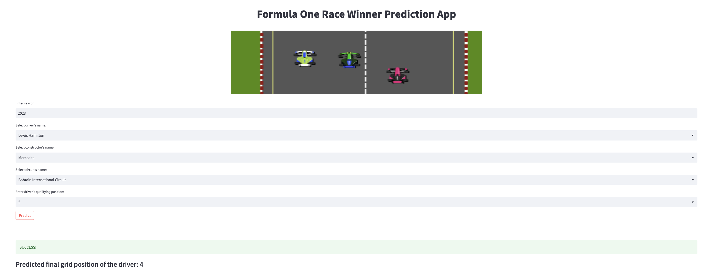
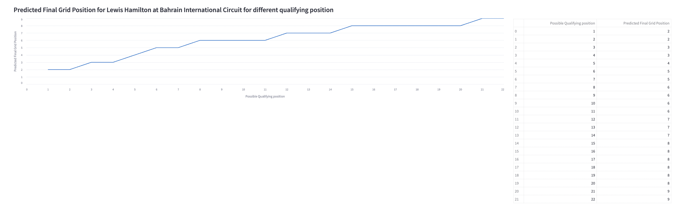

# Analysis of Formula One Race Data and Driver Rank Prediction

## What is Formula One?

Formula One (more commonly known as Formula 1 or F1) is the highest class of international racing for open-wheel single-seater formula racing cars sanctioned by the Fédération Internationale de l'Automobile (FIA). The FIA Formula One World Championship has been one of the premier forms of racing around the world since its inaugural season in 1950. The word formula in the name refers to the set of rules to which all participants' cars must conform.[1] A Formula One season consists of a series of races, known as Grands Prix. Grands Prix take place in multiple countries and continents around the world on either purpose-built circuits or closed public roads.

F1 racing is one of the oldest motorsports racing events, having started in 1950. It's one of the most popular sports in the world. This sport generates a vast quantity of data. Data is collected via sensors installed in the vehicles throughout practice, qualifying, and the final race sessions.

## Project Purpose

Big data analytics can give Formula 1 teams a competitive edge by enabling them to make informed decisions quickly and efficiently, leading to better race results.
Our research intends to go deep into past data in order to identify the driver's performance using various statistics like the number of pit stops the driver made, how much time it took to complete the race, how many points they scored, whether they were in podium position or not, and many other things. This will help us analyze the driver’s performance and will also lead to predicting future race results based on previous ones.

## Project Overview

This project tries to comprehend the data from previous Formula 1 races and forecast the race outcome based on user inputs using Machine Learning Algorithms. For data exploration and model construction, check out the jupyter notebooks.

## Installation

The project runs on [Python 3.10](https://www.python.org/downloads/release/python-3100/) and all requirements can be installed by the following command [pip](https://pip.pypa.io/en/stable/) package manager and requirement.txt


```bash
pip install -r requirements.txt
```

## Usage
After installation of all the required libraries, open your terminal, navigate to the folder containing the app.py file and run the below command.

```python
streamlit run app.py

```
The Streamlit web application will open in a new browser window hosted at your localhost. There will be an input form where the user can enter the season, driver name, constructor name, and circuit name in the respective dropdowns.

| Field Name | Description |
| --- | --- |
| Season | Enter the year for which you want to make the prediction |
| Driver's name | Select the driver's name for whom you want to make the prediction |
| Constructor's name | Select the constructor's name for whom the selected driver is driving |
| Circuit's name | Select the name of the circuit where the race is going to happen |



Click the predict button for the results.


